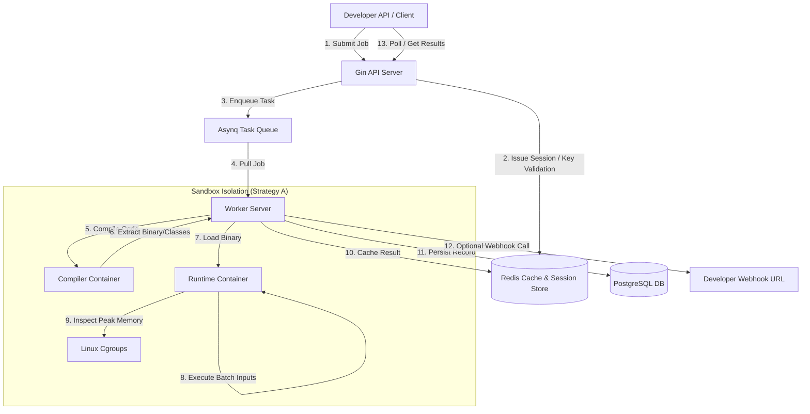

# ⚡ Code Execution Engine (SaaS Edition)

A high-performance, production-grade, distributed code execution engine built in **Go** and **React**. Submit source code via a secure developer REST API, run it inside isolated container sandboxes, and receive execution metrics (real-time statuses, precise runtimes, and peak memory).

Designed for online judges, technical interview systems, and educational coding platforms.

---

## 🏗️ System Architecture

The system utilizes an asynchronous worker pool, separate container-level compilation, and clean sandbox execution to guarantee safety and resource limits.



---

## 🛠️ Tech Stack & Key Features

### 💻 Backend (Go)
* **Gin & REST API**: High-throughput web routing.
* **Asynq Task Queue**: Concurrent, Redis-backed task queue with automatic retries and rate-limiting handles execution backpressure.
* **Redis Session Auth**: Stateful user authentication with cookie propagation and Bearer token fallback.
* **Atlas Schema Migrations**: Versioned database migrations generated from GORM models to control PostgreSQL structure deterministically.
* **Developer SDK Hooks**: Dynamic custom runtime limits (CPU, Memory, Time) and asynchronous webhook HTTP callbacks.

### 🎨 Frontend (React)
* **React, TypeScript & Vite**: Lightning-fast Hot Module Replacement and robust compiler safety.
* **shadcn/ui & TailwindCSS**: Beautiful modern aesthetic featuring dark-mode toggles, premium charts, and highly responsive grid designs.
* **Interactive Dashboard**:
  - **Metrics Visualizer**: Live charts mapping execution success ratios, popular compiler runtimes, and daily submission timelines.
  - **API Keys Manager**: Provision, track, and revoke developer credentials.
  - **Interactive Execution History**: Paginated record logger with language, status, and timeline filters.
  - **SaaS Billing Controls**: Sandbox plan tier management (Free, Pro, Ultimate).

---

## 🔒 Container Sandbox Hardening (Strategy A)

To run untrusted code safely, the execution pipeline separates compiling and running:

| Layer / Policy | Mechanism | Purpose |
| :--- | :--- | :--- |
| **Separated Compilers** | Compile in SDK-heavy environments, extract artifact, execute in slim runtimes | Prevents compiler memory spikes (e.g. `g++`, `javac`) from distorting user runtime metrics |
| **Network Block** | `NetworkDisabled: true` | Prevents sandboxed code from making outbound connections or SSRF attacks |
| **CPU Bounding** | `NanoCPUs: 500000000` (0.5 CPU) | Limits execution to half a CPU core per container |
| **Memory Isolation** | `MemoryLimit: 256MB` | Enforces hardware limits and prevents Out-Of-Memory (OOM) host fatigue |
| **Process Controls** | `PidsLimit: 512` | Thwarts fork bombs and thread exhaustion exploits |
| **Root Prevention** | Run as `User: 1000:1000` in `/tmp` | Drops superuser permissions and limits disk writes to temporary storage |
| **Capabilities Drop** | `CapDrop: ["ALL"]`, `SecurityOpt: ["no-new-privileges:true"]` | Blocks container break-outs and privilege escalation |
| **Kernel Monitoring** | Reads `/sys/fs/cgroup/memory.peak` | Fetches authentic peak container RAM usage |

---

## 🚀 Getting Started

### Prerequisites
- [Docker & Docker Desktop](https://www.docker.com/)
- [Bun](https://bun.sh/) or [Node.js](https://nodejs.org/) (for local frontend development)

### Multi-Service Spin-Up
To boot the full SaaS stack (API, worker, Redis, Postgres database, and automatic migrations runner):

```bash
# Clone the repository
git clone https://github.com/vivek6201/code-execution-engine.git
cd code-execution-engine

# Start the Docker Compose development services
docker compose -f docker-compose.dev.yml up --build
```

The API service will be available at `http://localhost:8080`.

---

## 💻 Running the Frontend

To run the dashboard UI locally:

```bash
cd frontend

# Install dependencies
bun install   # or npm install

# Run the development server
bun run dev   # or npm run dev
```

Open `http://localhost:5173` to interact with the SaaS dashboard.

---

## 🛰️ Developer API Reference

Authenticate requests by sending the header `X-API-Key: <your_key>`.

### 1. Submit Code Execution

`POST /api/v1/judge/run`

```json
{
  "code": "#include <iostream>\nusing namespace std;\nint main() {\n    int a, b;\n    if (cin >> a >> b) {\n        cout << (a + b) << endl;\n    }\n    return 0;\n}",
  "language": "cpp",
  "test_cases": [
    { "input": "5 7", "expected_output": "12" },
    { "input": "-1 1", "expected_output": "0" }
  ],
  "time_limit_ms": 2000,
  "memory_limit_kb": 128000,
  "callback_url": "https://your-domain.com/webhook-receiver"
}
```

**Response (202 Accepted):**
```json
{
  "success": true,
  "message": "Job queued successfully",
  "data": {
    "job_id": "474b3da7-4235-457e-9ae6-21b3e8cb6aa2"
  }
}
```

### 2. Poll Execution Status

`GET /api/v1/judge/run/:job_id`

**Response (SUCCESS):**
```json
{
  "success": true,
  "message": "Result fetched successfully",
  "data": {
    "status": "SUCCESS",
    "total": 2,
    "passed": 2,
    "time_ms": 95,
    "memory_kb": 5376,
    "test_cases": [
      {
        "input": "5 7",
        "expected_output": "12",
        "actual_output": "12\n",
        "status": "SUCCESS",
        "time_ms": 47
      },
      {
        "input": "-1 1",
        "expected_output": "0",
        "actual_output": "0\n",
        "status": "SUCCESS",
        "time_ms": 48
      }
    ]
  }
}
```

---

## 🛠️ Verification & Flow Testing

You can use the python workflow test script to register, log in, upgrade subscription plans, generate credentials, and submit jobs automatically across all four compilers (C++, Python, JS, Java):

```bash
# Run the automated developer API validation flow
python3 ./scratch/test_flow.py
```

---

## 📄 License
This project is open-source and released under the [MIT License](LICENSE).
